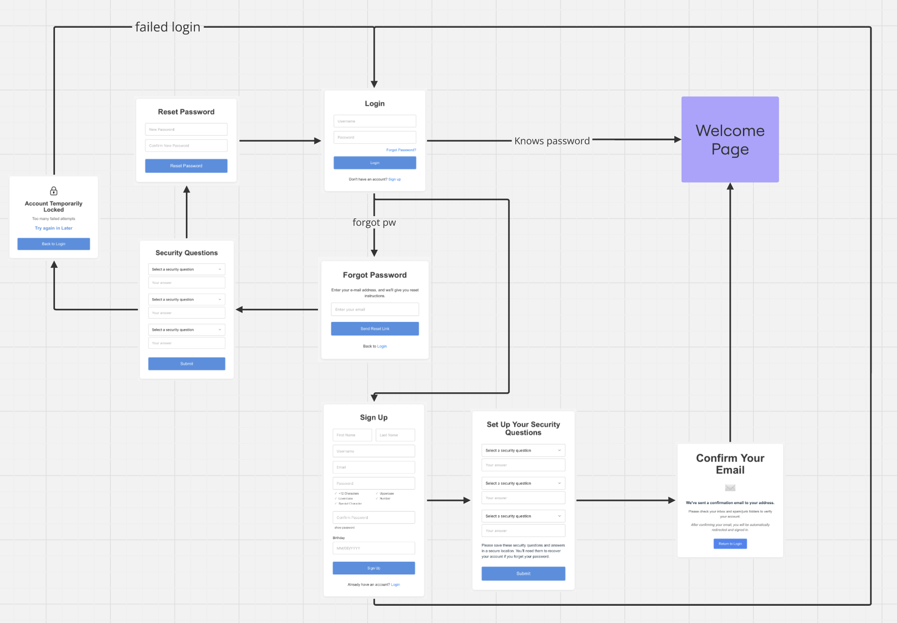

# User Auth Project Comp 424
A basic user authentication system built with React.js (frontend) and Node.js (backend). This project allows users to sign up, log in, and manage authentication securely. It integrates Amazon S3 for storage, AWS EC2 for the web server, and Google's reCAPTCHA for bot protection.

## Project Overview: Secure Web Server & Login System
Our project is focused on developing a secure web server and authentication system for a small business, ensuring both ease of use and strong security measures. The system will allow users to safely log in, track their login history, and access a confidential company file while protecting against cyber threats.

## User Authentication Flow
Below is the authentication workflow for this project:


## Key Features

### 1. Secure User Authentication
- A dedicated **login page** where users can enter their credentials.
- **Sign-up process** with:
  - First and last name, birth date, and email.
  - Secure password creation with real-time strength feedback.
  - CAPTCHA verification to prevent bots.
  - Email-based account activation.
  - Security questions for password recovery.
- **Forgot Username or Password?** feature for secure recovery options.

#### 2. Personalized User Dashboard  
- After logging in, users will see:  
  - **Personalized greeting**: "Hi, (First Name Last Name)"  
  - **Login history**: "You have logged in X times."  
  - **Last login date**: "Last login date: Y."  
- Users can download a **secure company document** (`company_confidential_file.txt`).

### 3. Strong Security Measures  
- **HTTPS encryption** for secure data transmission.  
- **Two-Factor Authentication (2FA)** (extra credit feature) for enhanced security.  
- **Logging system** to track successful and failed login attempts.  
- **Intrusion detection system (IDS)** to monitor for suspicious activities.  
- Protection against:  
  - **Brute force attacks** (e.g., login attempt limitations).  
  - **SQL injection** (e.g., parameterized queries).  
  - **Buffer overflow attacks** (e.g., input validation).  
  - **Cross-site scripting (XSS)** (e.g., input sanitization).  
  - **Cross-site request forgery (CSRF)** (e.g., secure tokens).
 
### 4. Secure Web Server Setup  
- **AWS EC2** for hosting the web server.  
- **Amazon S3** for secure storage.  
- **LAMP stack (Linux, Apache, MySQL, PHP)** for backend services.  
- **Firewall (IPTables)** and **Intrusion Detection System (Snort)** for added security.  
- Automated **installation and security configuration scripts** for disaster recovery.

## How to run project 
1. Clone the repository
2. Ensure Node.js is installed (Check with `node -v` and `npm -v`).
3. Install dependencies:
```
npm install
```
3. Start the development server:
```
cd frontend
npm run dev
```
